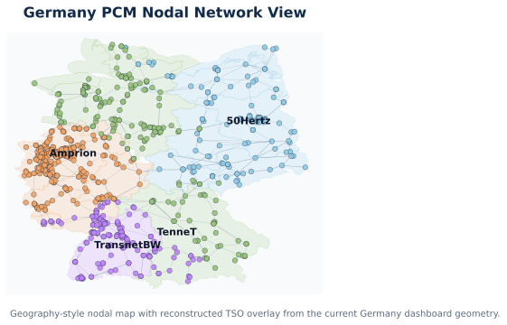

# `GERMANY_PCM` case suite

Primary nodal case path: `ModelCases/GERMANY_PCM_nodal_case`
Primary nodal data path: `ModelCases/GERMANY_PCM_nodal_case/Data_GERMANY_PCM_nodal`

Primary zonal case path: `ModelCases/GERMANY_PCM_zonal4_case`
Primary zonal data path: `ModelCases/GERMANY_PCM_zonal4_case/Data_GERMANY_PCM_zonal4`

Dashboard demo case path: `ModelCases/GERMANY_PCM_nodal_jan_2day_rescaled_case`

## Dashboard

Interactive dashboard for this case: start it from the repo root with `python tools/hope_dashboard/app.py`, then open `http://127.0.0.1:8050/` in your browser.

## Current Build Summary

This Germany build is designed as a comparison-ready PCM case suite:

- one canonical Germany nodal master case
- one 4-zone Germany zonal derivative case
- one solved 2-day nodal demo case for dashboard exploration

The guiding design rule is:

- build the nodal case first
- freeze geography and chronology mappings once
- derive the zonal case mechanically from the nodal master case

## Source Stack

- Network backbone:
  - OSM Europe transmission dataset from Xiong et al. 2025
  - PyPSA-Eur workflow used as the main preprocessing reference
- Generator fleet:
  - `powerplantmatching` first-pass Germany fleet inventory
  - BNetzA MaStR and Kraftwerksliste reserved as validation layers
- Chronology:
  - SMARD Germany load and actual generation
  - four SMARD TSO-area load helper files for `50Hertz`, `Amprion`, `TenneT`, and `TransnetBW`
- Dashboard zone geometry:
  - Germany state-boundary GeoJSON reconstructed into a 4-TSO dashboard overlay

## Model Setup Snapshot

### Nodal master case

| Setting | Value |
| :-- | :-- |
| `model_mode` | `PCM` |
| `network_model` | `2` (nodal angle-based DC) |
| `unit_commitment` | `0` |
| `transmission_loss` | `0` |
| `carbon_policy` | `0` |
| `clean_energy_policy` | `0` |
| `endogenous_rep_day` | `0` |
| `external_rep_day` | `0` |

Settings file: `ModelCases/GERMANY_PCM_nodal_case/Settings/HOPE_model_settings.yml`

### Zonal derivative case

| Setting | Value |
| :-- | :-- |
| `model_mode` | `PCM` |
| `network_model` | `1` (zonal transport) |
| `unit_commitment` | `0` |
| `transmission_loss` | `0` |
| `carbon_policy` | `0` |
| `clean_energy_policy` | `0` |
| `endogenous_rep_day` | `0` |
| `external_rep_day` | `0` |

Settings file: `ModelCases/GERMANY_PCM_zonal4_case/Settings/HOPE_model_settings.yml`

## Current Case Snapshot

| Metric | Nodal master | Zonal derivative |
| :-- | --: | --: |
| Buses / zones | `783` buses | `4` zones |
| Lines / interfaces | `1174` lines | `5` interfaces |
| Generator entries | `4135` | `46` |
| Chronology basis | `8760` hourly rows | derived from the same hourly basis |
| Geography | nodal bus-level PCM | 4-zone TSO aggregation |

## Network View

Map note: this is a geography-style nodal network map built from the solved Germany dashboard demo case, with the reconstructed TSO overlay shown behind the nodal transmission network. It is intended as an engineering-style case map, not as an official public TSO GIS rendering.

## Current Solved Status

The current full-year Germany zonal derivative case has been assembled and solved.

The current full-year Germany nodal master case has been assembled, but the practical dashboard example is the shorter solved nodal demo case below.

### Solved nodal dashboard demo case

| Metric | Value |
| :-- | --: |
| Case | `GERMANY_PCM_nodal_jan_2day_rescaled_case` |
| Hours | `48` |
| Solve status | `OPTIMAL` |
| Load shedding | `0.0` |
| Total operating cost | about `9.996855e6` |

Reference output: `ModelCases/GERMANY_PCM_nodal_jan_2day_rescaled_case/output`

## Geography and Mapping Notes

- `Bus_id` is the operating geography for the nodal Germany PCM case.
- `Zone_id` uses four Germany research zones:
  - `50Hertz`
  - `Amprion`
  - `TenneT`
  - `TransnetBW`
- The zonal case is an internal research aggregation for comparison, not the real DE-LU bidding-zone market design.
- The Germany dashboard TSO overlay is file-backed and more realistic than bubble polygons, but it is still a reconstructed research layer rather than an official public TSO shapefile.

## Integration Workflow

- Raw OSM Europe network tables are cleaned into a HOPE-ready Germany network backbone.
- A frozen `Bus_id -> Zone_id` map is created once and reused by both nodal and zonal builds.
- The Germany fleet is cleaned from `powerplantmatching` and each generator is assigned to one nodal bus.
- SMARD chronology is normalized once and reused across nodal and zonal builds.
- The zonal case is derived by aggregation from the nodal master case rather than calibrated separately.

## Validation and Debugging Notes

- Initial Germany nodal debug runs exposed:
  - disconnected-network issues
  - singular-network behavior
  - reactance / angle-scaling pathologies
- The main fixes were:
  - transformer connectivity retention
  - keeping the largest connected component
  - HOPE-compatible reactance normalization for the DCOPF network
- After those fixes, the 1-day and 2-day full-nodal Germany debug cases solved cleanly and the 2-day case became the dashboard default.

## Current Limitations

- The 4-zone Germany comparison setup is a research zoning, not a market replication model.
- The dashboard TSO geometry is reconstructed from real outer geography plus frozen case geography, not from an official control-area GIS layer.
- The short solved nodal demo case is dashboard-ready, but longer nodal horizons still need staged solve validation.
- Generator validation against MaStR and Kraftwerksliste can still be deepened.

## Reference Files

- Build workspace: `tools/germany_pcm_case_related`
- Case blueprint: `tools/germany_pcm_case_related/GERMANY_PCM_CASE_BLUEPRINT.md`
- Source manifest: `tools/germany_pcm_case_related/SOURCE_MANIFEST.md`
- Source register: `tools/germany_pcm_case_related/references/SOURCE_DATA_REGISTER.csv`
- Network workflow: `tools/germany_pcm_case_related/references/NETWORK_BACKBONE_WORKFLOW.md`
- Bus-zone workflow: `tools/germany_pcm_case_related/references/BUS_ZONE_MAPPING_WORKFLOW.md`
- Generator workflow: `tools/germany_pcm_case_related/references/GENERATOR_FLEET_WORKFLOW.md`
- Chronology workflow: `tools/germany_pcm_case_related/references/CHRONOLOGY_WORKFLOW.md`
- TSO geometry workflow: `tools/germany_pcm_case_related/references/TSO_ZONE_GEOMETRY_WORKFLOW.md`
