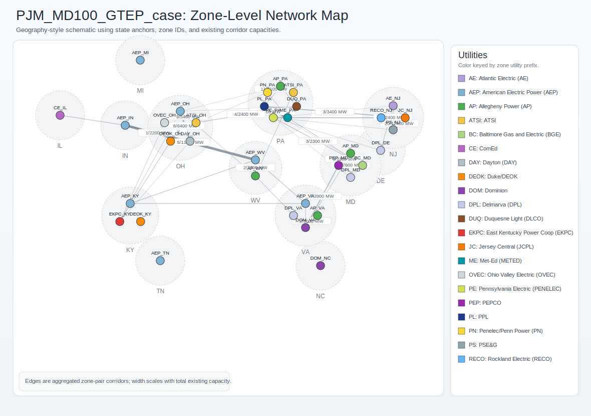

# `PJM_MD100_GTEP_case`

Case path: `ModelCases/PJM_MD100_GTEP_case`  
Data path: `ModelCases/PJM_MD100_GTEP_case/Data_PJM_GTEP_subzones`

## Model Setup Snapshot

| Setting | Value |
| :-- | :-- |
| `model_mode` | `GTEP` |
| `resource_aggregation` | `1` |
| `endogenous_rep_day` | `1` |
| `external_rep_day` | `0` |
| `inv_dcs_bin` | `0` |
| `operation_reserve_mode` | `0` |

## System Scale Overview

| Metric | Value |
| :-- | --: |
| Zones | 35 |
| States | 13 |
| Existing generators | 3,565 |
| Thermal generators | 1,686 |
| VRE generators | 884 |
| Existing storage units | 56 |
| Existing transmission lines | 180 |
| Unique zone-to-zone corridors | 54 |
| Existing generator capacity | 207,809.9 MW |
| Existing storage power/energy | 5,396.9 MW / 21,587.6 MWh |
| Sum of zonal peak demands | 181,827.9 MW |
| Hourly load profile rows | 8,760 |

## Candidate Expansion Options

| Metric | Value |
| :-- | --: |
| Candidate generators | 137 |
| Candidate generator capacity | 985,000 MW |
| Candidate storage units | 22 |
| Candidate storage power/energy | 440,000 MW / 1,760,000 MWh |
| Candidate lines | 53 |
| Candidate line capacity | 125,800 MW |

## Existing Capacity Mix Highlights

| Type | Units | Existing Capacity (MW) |
| :-- | --: | --: |
| NGCC | 288 | 56,951.3 |
| Coal | 124 | 51,935.1 |
| NGCT | 707 | 43,616.3 |
| NuC | 26 | 28,901.2 |
| Oil | 538 | 6,656.9 |
| SolarPV | 787 | 6,128.8 |
| WindOn | 95 | 5,287.9 |

## Network View (Zone-Level, Geography-Style)

Map note: this is a geography-style engineering schematic anchored by state positions and PJM-style zone labels.  
It is not a strict GIS shapefile rendering, but the edge capacities and zone connections are from the model inputs.
