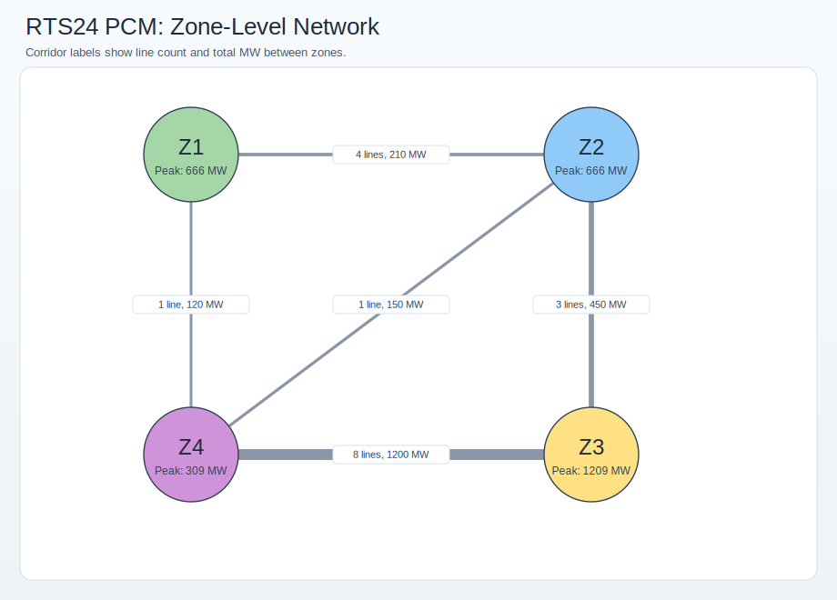
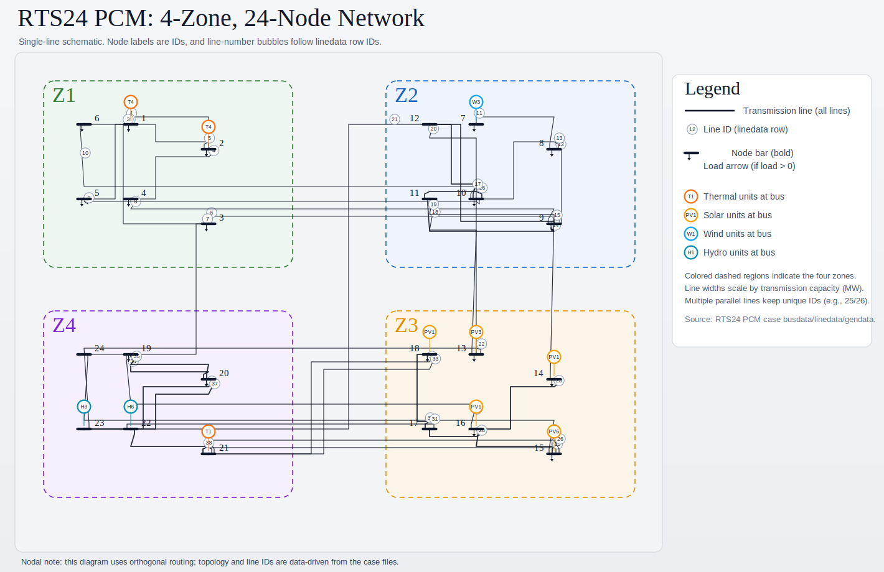

# `RTS24_PCM_multizone4_congested_1month_case`

Case path: `ModelCases/RTS24_PCM_multizone4_congested_1month_case`
Data path: `ModelCases/RTS24_PCM_multizone4_congested_1month_case/Data_RTS24_PCM_full`

## Dashboard

Interactive dashboard for this case: start it from the repo root with `python tools/hope_dashboard/app.py`, then open `http://127.0.0.1:8050/` in your browser.

### How to Read This Dashboard

- `LMP Spread` is the system-wide maximum minus minimum bus LMP at the selected hour.
- `Basis` is the Focus Bus LMP minus the Compare Bus LMP, so it is a pair-specific price difference.
- `Constraint / Line Ranking` shows the most important transmission lines at the selected hour based on the chosen ranking metric.
- `Top Bus Congestion Contributors` explains how the selected line affects bus congestion prices:
  positive bars push bus prices up, while negative bars push them down.
- A practical workflow is:
  1. find an hour with a large spread
  2. click the most important line in the ranking panel
  3. inspect which buses have the largest positive and negative congestion contributions
  4. set those buses as `Focus Bus` and `Compare Bus` to study their basis over time

## Model Setup Snapshot

| Setting | Value |
| :-- | :-- |
| `model_mode` | `PCM` |
| `unit_commitment` | `1` |
| `network_model` | `3` (nodal PTDF) |
| `operation_reserve_mode` | `2` |
| `flexible_demand` | `1` |
| `clean_energy_policy` | `0` |
| `carbon_policy` | `0` |
| `endogenous_rep_day` | `0` |
| `external_rep_day` | `0` |

## System Scale Overview

| Metric | Value |
| :-- | --: |
| Zones | 4 |
| Buses | 24 |
| Existing generators | 33 |
| Thermal generators | 9 |
| VRE generators | 15 |
| Existing storage units | 5 |
| DR resources | 4 |
| Existing transmission lines | 38 |
| Inter-zone lines | 17 |
| Unique inter-zone corridors | 5 |
| Existing generator capacity | 3,406.0 MW |
| Existing storage power/energy | 153.1 MW / 612.5 MWh |
| Sum of zonal peak demands | 2,850.0 MW |
| Hourly load profile rows | 744 |

## Existing Capacity Mix Highlights

| Type | Units | Existing Capacity (MW) |
| :-- | --: | --: |
| SolarPV | 12 | 1,362.0 |
| Hydro | 9 | 960.0 |
| NGCC | 1 | 400.0 |
| Coal | 8 | 384.0 |
| WindOn | 3 | 300.0 |

## Zone-Level Network View

## Nodal-Level Network View (24 Buses)

| Nodal metric | Value |
| :-- | --: |
| Buses per zone | 6 in each of Z1-Z4 |
| Intra-zone lines | 21 |
| Inter-zone tie lines | 17 |
| Intra-zone transfer capacity sum | 7,500 MW |
| Inter-zone transfer capacity sum | 2,130 MW |

Nodal note: this figure is topology-accurate to the case connectivity and line capacities; node labels are bus IDs, and line labels are linedata row IDs.
