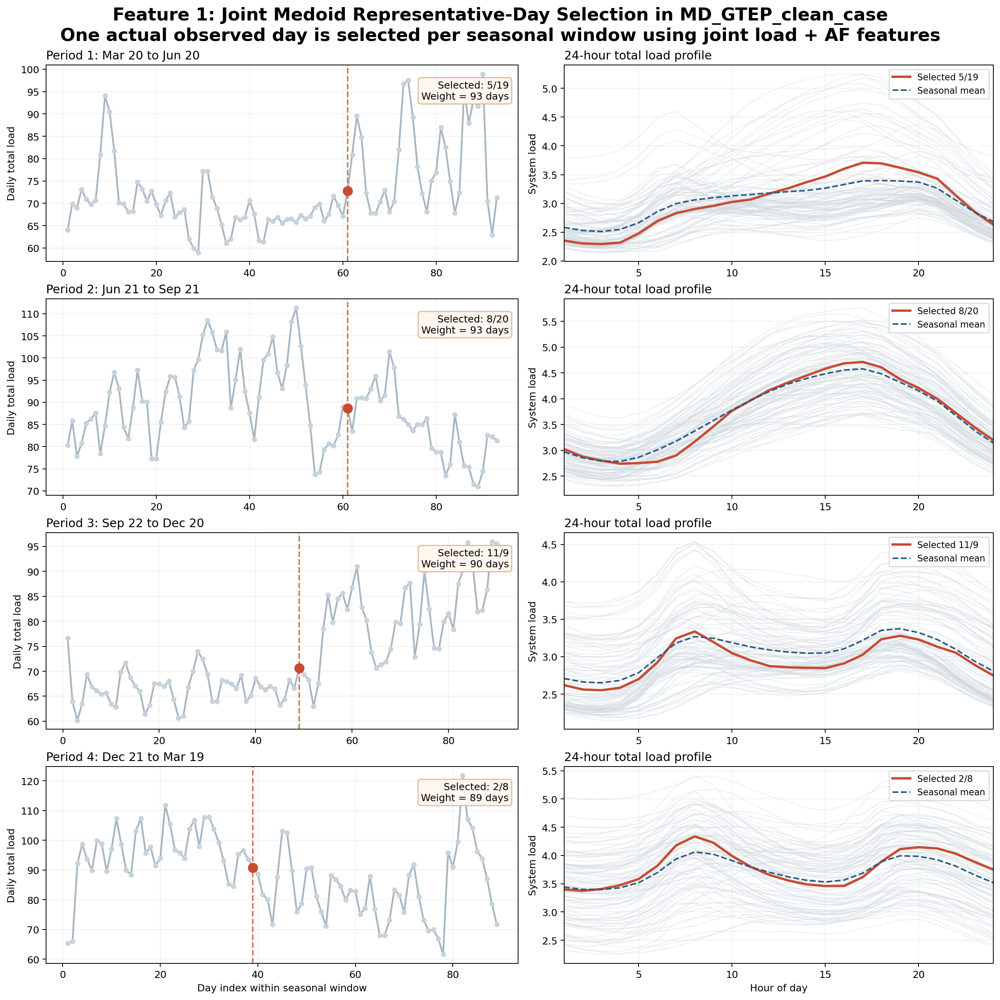
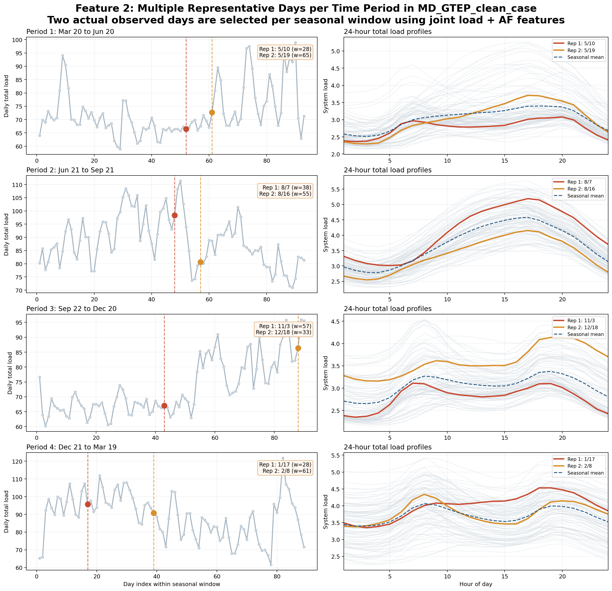
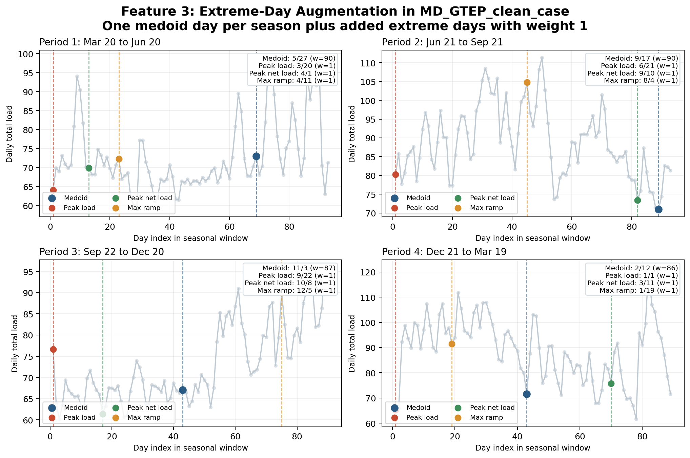
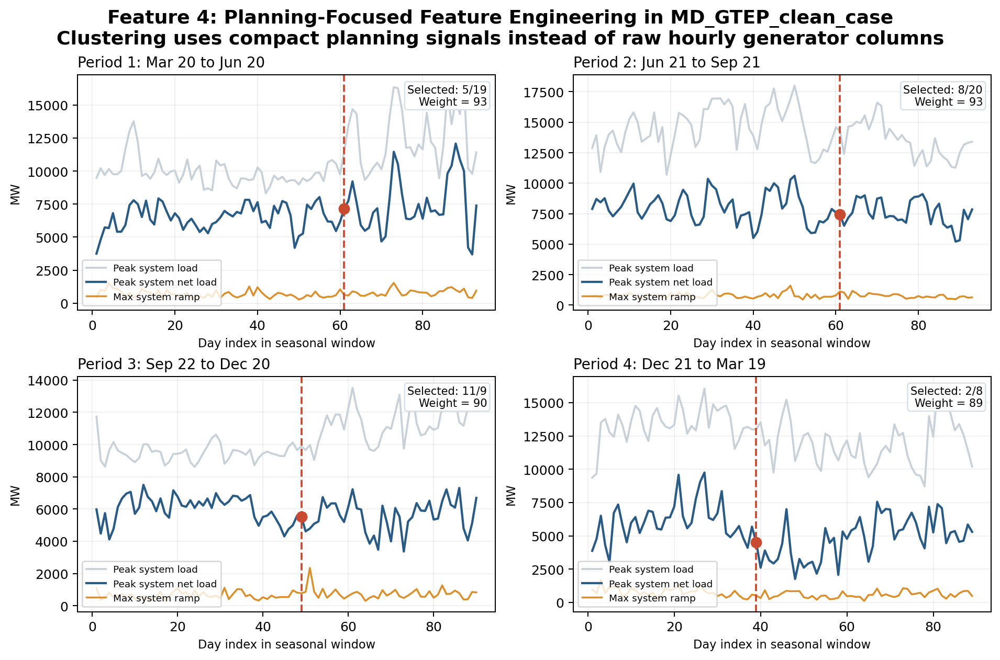
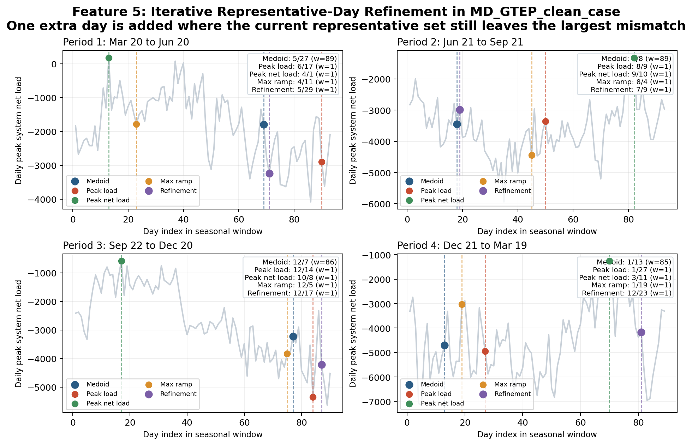
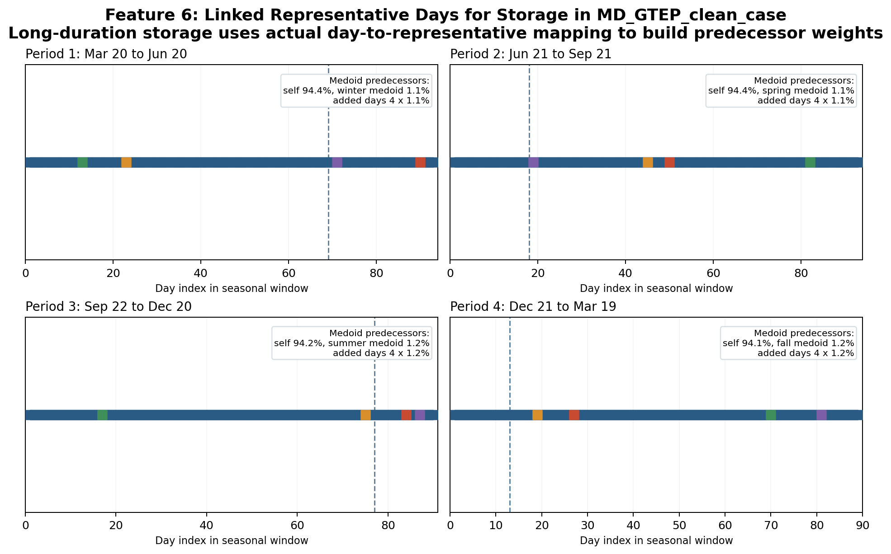

```@meta
CurrentModule = HOPE
```

# Representative Days

HOPE keeps the representative-day mode switch in `HOPE_model_settings.yml`:

```yaml
endogenous_rep_day: 1
external_rep_day: 0
```

When `endogenous_rep_day = 1`, HOPE reads the advanced endogenous representative-day controls from:

```text
Settings/HOPE_rep_day_settings.yml
```

This keeps `HOPE_model_settings.yml` high-level while leaving the chronology-reduction details in a separate advanced settings file.

## Representative-Day Feature Roadmap

The user-facing representative-day feature set is:

- `Feature 1: Joint Medoid Representative-Day Selection`
- `Feature 2: Multiple Representative Days per Time Period`
- `Feature 3: Extreme-Day Augmentation`
- `Feature 4: Planning-Focused Feature Engineering`
- `Feature 5: Iterative Representative-Day Refinement`
- `Feature 6: Linked Representative Days for Storage`

## Common Settings

A typical `HOPE_rep_day_settings.yml` starts from:

```yaml
time_periods:
  1: [1, 1, 3, 31]
  2: [4, 1, 6, 30]
  3: [7, 1, 9, 30]
  4: [10, 1, 12, 31]

clustering_method: kmedoids
feature_mode: joint_daily
planning_feature_set:
  - zonal_load
  - zonal_net_load
  - zonal_wind_cf
  - zonal_solar_cf
  - system_net_load
  - system_ramp
representative_days_per_period: 1
add_extreme_days: 0
extreme_day_metrics:
  - peak_load
  - peak_net_load
  - min_wind
  - min_solar
  - max_ramp
iterative_refinement: 0
iterative_refinement_days_per_period: 1
link_storage_rep_days: 0
include_load: 1
include_af: 1
include_dr: 1
normalize_features: 1
```

Meaning:

- `time_periods`: seasonal windows used for endogenous representative-day construction
- `clustering_method: kmedoids`: select actual observed days instead of synthetic centroids
- `feature_mode`: choose how HOPE constructs the daily feature vector before clustering
- `planning_feature_set`: used when `feature_mode: planning_features`
- `representative_days_per_period`: number of medoid days per seasonal window
- `add_extreme_days`: turn Feature 3 on or off
- `extreme_day_metrics`: choose which stress events HOPE adds explicitly
- `iterative_refinement`: turn Feature 5 on or off
- `iterative_refinement_days_per_period`: number of extra refinement days HOPE adds after the medoid/extreme selection
- `link_storage_rep_days`: turn Feature 6 on or off for long-duration storage
- `include_load`, `include_af`, `include_dr`: used by `feature_mode: joint_daily`
- `normalize_features: 1`: standardize feature dimensions before distance calculations

## Understanding `time_periods`

Each `time_periods` entry uses the format:

```yaml
period_id: [start_month, start_day, end_month, end_day]
```

So this example:

```yaml
time_periods:
  1: [1, 1, 3, 31]
  2: [4, 1, 6, 30]
  3: [7, 1, 9, 30]
  4: [10, 1, 12, 31]
```

means:

- `1`: January 1 to March 31
- `2`: April 1 to June 30
- `3`: July 1 to September 30
- `4`: October 1 to December 31

In endogenous representative-day mode, HOPE uses these windows like this:

1. collect all full-chronology days that fall inside each window
2. build one daily feature vector for each real day in that window
3. cluster only within that window
4. pick one or more representative days from that same window
5. assign weights so the representative periods map back to the original number of real days

So `time_periods` does not define optimization hours directly. It defines the seasonal buckets inside which HOPE searches for representative days.

Year-wrapping windows are also supported. For example:

```yaml
time_periods:
  1: [11, 1, 2, 28]
```

means November 1 through February 28.

## Feature 1: Joint Medoid Representative-Day Selection

### Focus

Feature 1 fixes the biggest weakness of the old endogenous representative-day method: it no longer constructs one synthetic day independently for each column.

### Mechanism

Feature 1:

- builds one joint daily feature vector using aligned load, generator availability, and optional DR profiles
- clusters real days within each seasonal window
- selects one actual observed medoid day per time period

That means load, wind, solar, and other included inputs now come from the same real day.

### Interpretation

Feature 1 should be interpreted as:

- one real representative day per seasonal window
- one weight per seasonal window
- better preservation of cross-series consistency than the old centroid method

It is still a fairly aggressive reduction, because each season is compressed into only one day.

### Recommendation

Use Feature 1 when:

- you want a simple and robust endogenous representative-day workflow
- you want actual observed days instead of synthetic days
- solve speed matters more than fine chronology detail

This is the best starting point for most endogenous rep-day studies.

### Example

Using the existing case `MD_GTEP_clean_case`, with:

```yaml
time_periods:
  1: [3, 20, 6, 20]
  2: [6, 21, 9, 21]
  3: [9, 22, 12, 20]
  4: [12, 21, 3, 19]
feature_mode: joint_daily
representative_days_per_period: 1
add_extreme_days: 0
```

HOPE selects:

| Time Period | Seasonal Window | Selected Representative Day | Weight (Days Represented) |
| :-- | :-- | :-- | :-- |
| `1` | Mar 20 to Jun 20 | May 19 | `93` |
| `2` | Jun 21 to Sep 21 | Aug 31 | `93` |
| `3` | Sep 22 to Dec 20 | Dec 7 | `90` |
| `4` | Dec 21 to Mar 19 | Jan 13 | `89` |



How to read the figure:

- left column: daily total load across each seasonal window, with the selected representative day highlighted
- right column: all 24-hour total load profiles in that season shown in gray, the selected representative day in red, and the seasonal mean in dashed blue

## Feature 2: Multiple Representative Days per Time Period

### Focus

Feature 2 reduces over-smoothing within each season by allowing more than one medoid day.

### Mechanism

Feature 2 keeps the same clustering logic as Feature 1, but instead of selecting one medoid day per seasonal window, it selects `k` medoid days:

- each selected day is still an actual observed day
- each selected day gets its own weight
- the total weight across the selected days still equals the number of real days in that seasonal window

### Interpretation

Feature 2 should be interpreted as:

- one season can now contain several representative daily patterns
- weights are cluster sizes, so they do not have to be equal
- more representative days means less smoothing but longer solve time

This is usually the first upgrade to make if one representative day per season feels too coarse.

### Recommendation

Use Feature 2 when:

- one day per season is too restrictive
- storage, adequacy, or VRE variability matter more strongly
- you want a moderate accuracy improvement without changing the basic workflow

Typical values are `2` to `4` representative days per seasonal window.

### Example

Using the same `MD_GTEP_clean_case`, with:

```yaml
feature_mode: joint_daily
representative_days_per_period: 2
add_extreme_days: 0
```

HOPE selects:

| Time Period | Seasonal Window | Representative Day 1 | Weight 1 | Representative Day 2 | Weight 2 |
| :-- | :-- | :-- | :-- | :-- | :-- |
| `1` | Mar 20 to Jun 20 | Apr 22 | `45` | May 7 | `48` |
| `2` | Jun 21 to Sep 21 | Jul 29 | `54` | Aug 15 | `39` |
| `3` | Sep 22 to Dec 20 | Oct 28 | `38` | Nov 26 | `52` |
| `4` | Dec 21 to Mar 19 | Jan 28 | `64` | Mar 18 | `25` |



How to read the figure:

- left column: daily total load across each seasonal window, with both selected representative days highlighted
- right column: all 24-hour total load profiles in that season shown in gray, with the two selected representative days highlighted separately

## Feature 3: Extreme-Day Augmentation

### Focus

Feature 3 protects the model against missing rare but important stress events.

### Mechanism

Feature 3 works on top of Features 1-2:

1. HOPE selects the medoid-based representative days
2. HOPE scans the same seasonal window for extreme days requested by the user
3. HOPE adds those extreme days explicitly with weight `1`
4. HOPE reduces the medoid weight so the total represented days stay unchanged

Supported metrics are:

- `peak_load`
- `peak_net_load`
- `min_wind`
- `min_solar`
- `max_ramp`

### Interpretation

Feature 3 should be interpreted as:

- medoids still represent the bulk of the season
- extreme days are carved out explicitly
- if two metrics hit the same day, HOPE adds that day only once

This is especially important for reliability, capacity adequacy, and stress-event studies.

### Recommendation

Use Feature 3 when:

- you care about missed scarcity events
- you are studying adequacy, load shedding, reserve stress, or capacity credit
- VRE droughts or ramp events matter materially

This is a high-value feature for planning models that are sensitive to tail events.

### Example

Using the same `MD_GTEP_clean_case`, with:

```yaml
feature_mode: joint_daily
representative_days_per_period: 1
add_extreme_days: 1
extreme_day_metrics:
  - peak_load
  - peak_net_load
  - max_ramp
```

HOPE selects:

| Time Period | Seasonal Window | Medoid Day | Medoid Weight | Peak Load Day | Peak Net Load Day | Max Ramp Day |
| :-- | :-- | :-- | :-- | :-- | :-- | :-- |
| `1` | Mar 20 to Jun 20 | May 27 | `90` | Mar 20 | Apr 1 | Apr 11 |
| `2` | Jun 21 to Sep 21 | Sep 17 | `90` | Jun 21 | Sep 10 | Aug 4 |
| `3` | Sep 22 to Dec 20 | Nov 3 | `87` | Sep 22 | Oct 8 | Dec 5 |
| `4` | Dec 21 to Mar 19 | Feb 12 | `86` | Jan 1 | Mar 11 | Jan 19 |



How to read the figure:

- each panel is one seasonal window
- the blue marker is the medoid representative day
- the colored markers are the added extreme days
- each added extreme day gets weight `1`

## Feature 4: Planning-Focused Feature Engineering

### Focus

Feature 4 changes what HOPE clusters on.

Instead of clustering directly on the raw hourly input columns, HOPE can cluster on a compact set of planning-oriented signals.

### Mechanism

With:

```yaml
feature_mode: planning_features
```

HOPE builds a daily feature vector from engineered quantities such as:

- `zonal_load`
- `zonal_net_load`
- `zonal_wind_cf`
- `zonal_solar_cf`
- `system_load`
- `system_net_load`
- `zonal_ramp`
- `system_ramp`
- `ni`

This shifts the clustering emphasis from raw column similarity toward the signals that matter more for planning decisions.

### Interpretation

Feature 4 should be interpreted as:

- a different distance metric for deciding which days are “similar”
- more emphasis on adequacy, VRE shape, net load, and ramp behavior
- less sensitivity to low-value noise in raw generator-level hourly columns

The selected representative days can change even when the time periods and number of medoids stay the same.

### Recommendation

Use Feature 4 when:

- you want representative days that reflect planning stress rather than raw data similarity
- storage, net-load shape, and VRE interactions matter
- you have many generator-level columns and do not want them to dominate clustering

This is a strong next step once the basic medoid workflow is already in place.

### Example

Using `MD_GTEP_clean_case`, with:

```yaml
feature_mode: planning_features
planning_feature_set:
  - zonal_load
  - zonal_net_load
  - zonal_wind_cf
  - zonal_solar_cf
  - system_net_load
  - system_ramp
representative_days_per_period: 1
add_extreme_days: 0
```

HOPE selects:

| Time Period | Seasonal Window | Selected Representative Day | Weight (Days Represented) |
| :-- | :-- | :-- | :-- |
| `1` | Mar 20 to Jun 20 | May 27 | `93` |
| `2` | Jun 21 to Sep 21 | Jul 8 | `93` |
| `3` | Sep 22 to Dec 20 | Dec 7 | `90` |
| `4` | Dec 21 to Mar 19 | Jan 13 | `89` |



Compared with Feature 1, the visible change in this example is time period `2`, where the selected representative day shifts from `Aug 31` to `Jul 8`. That happens because Feature 4 is no longer trying to match every raw hourly column equally. Instead, it prioritizes the planning-oriented signals in `planning_feature_set`, such as system net load and ramp behavior.

How to read the figure:

- gray line: daily peak system load
- blue line: daily peak system net load
- orange line: daily maximum system ramp
- red dashed marker: the selected representative day for that seasonal window

## Feature 5: Iterative Representative-Day Refinement

### Focus

Feature 5 adds one more layer of protection against poorly represented days.

After HOPE has already selected the medoid days and any requested extreme days, it looks for the real day that is still least well represented in the current feature space and adds it explicitly.

### Mechanism

Feature 5 works on top of Features 1-4:

1. HOPE selects the medoid-based representative days
2. HOPE optionally adds explicit extreme days
3. HOPE measures the remaining feature-space mismatch between each real day and its nearest selected representative day
4. HOPE adds the worst-represented real day as a `refinement_day`
5. HOPE reduces the original medoid weight so the total represented days stay unchanged

In the current implementation, the refinement score is based on the same normalized representative-day feature space used for clustering. So Feature 5 is still a pre-solve refinement step, but it is targeted at the part of the season that the existing representative set still misses most strongly.

### Interpretation

Feature 5 should be interpreted as:

- a targeted cleanup pass after the main representative-day selection
- a way to reduce residual representation error without jumping to many more medoid days
- a useful bridge between simple clustering and more expensive fully iterative solve-and-validate workflows

The refinement day is not necessarily the highest-load day or the lowest-wind day. It is the day that is most poorly represented after considering the medoid days and any already-added extreme days.

### Recommendation

Use Feature 5 when:

- you already use Features 3 or 4 and still want one more targeted day per season
- you want better chronology coverage without a large increase in representative-day count
- you want a higher-fidelity endogenous rep-day set for adequacy, VRE, and storage studies

This is a good option when `representative_days_per_period = 1` still feels too coarse, but you do not want to move all the way to several medoids per season.

### Example

Using `MD_GTEP_clean_case`, with:

```yaml
feature_mode: planning_features
planning_feature_set:
  - zonal_load
  - zonal_net_load
  - zonal_wind_cf
  - zonal_solar_cf
  - system_net_load
  - system_ramp
representative_days_per_period: 1
add_extreme_days: 1
extreme_day_metrics:
  - peak_load
  - peak_net_load
  - max_ramp
iterative_refinement: 1
iterative_refinement_days_per_period: 1
```

HOPE selects:

| Time Period | Seasonal Window | Medoid Day | Medoid Weight | Peak Load Day | Peak Net Load Day | Max Ramp Day | Refinement Day |
| :-- | :-- | :-- | :-- | :-- | :-- | :-- | :-- |
| `1` | Mar 20 to Jun 20 | May 27 | `89` | Jun 17 | Apr 1 | Apr 11 | May 29 |
| `2` | Jun 21 to Sep 21 | Jul 8 | `89` | Aug 9 | Sep 10 | Aug 4 | Jul 9 |
| `3` | Sep 22 to Dec 20 | Dec 7 | `86` | Dec 14 | Oct 8 | Dec 5 | Dec 17 |
| `4` | Dec 21 to Mar 19 | Jan 13 | `85` | Jan 27 | Mar 11 | Jan 19 | Dec 23 |



How to read the figure:

- gray line: daily peak system net load in the seasonal window
- blue marker: the medoid day
- colored markers: the explicitly added extreme days
- purple marker: the added refinement day
- the refinement day is chosen because it still has the largest remaining mismatch relative to the already selected representative-day set

## Feature 6: Linked Representative Days for Storage

### Focus

Feature 6 improves how long-duration storage sees time.

The earlier representative-day features improve which days are selected. Feature 6 improves how those selected days are connected, so long-duration storage is no longer forced to move only through a simple `t-1` sequence.

### Mechanism

When:

```yaml
link_storage_rep_days: 1
```

HOPE extends the endogenous representative-day preprocessing with storage-linkage metadata:

1. each real day in the full chronology is mapped to one selected representative period
2. HOPE records the actual chronological sequence of those assigned representative periods over the year
3. HOPE builds predecessor weights for each representative period from the observed day-to-day transitions
4. HOPE also records run-length statistics for each representative period
5. in GTEP representative-day mode, long-duration storage uses those predecessor weights in the SOC linkage constraints

So the input-processing improvement is important here. Feature 6 is not only a constraint change. It also creates new chronology metadata from the original full-year daily sequence.

In the current implementation:

- short-duration storage still uses the existing start/end anchor logic
- long-duration storage uses weighted predecessor linkage derived from the actual representative-day assignment map

### Interpretation

Feature 6 should be interpreted as:

- a chronology-aware upgrade for long-duration storage
- a better approximation of seasonal carryover than a simple fixed `t-1` ordering
- a way to preserve some persistence and recurrence information from the original year without returning to full 8760 modeling

The key idea is that a representative day can now mostly follow itself, but still receive small transition weights from rare stress days and from the previous seasonal medoid when the real calendar sequence says that happens.

### Recommendation

Use Feature 6 when:

- long-duration storage or pumped storage matters materially
- seasonal energy shifting is important
- you already use representative days but want a more realistic SOC linkage for storage
- the simple inter-period `t-1` linkage feels too artificial

This is especially useful when combined with Features 4 and 5, because then both the selected representative days and the storage chronology linkage are planning-focused.

### Example

Using `MD_GTEP_clean_case`, with:

```yaml
feature_mode: planning_features
planning_feature_set:
  - zonal_load
  - zonal_net_load
  - zonal_wind_cf
  - zonal_solar_cf
  - system_net_load
  - system_ramp
representative_days_per_period: 1
add_extreme_days: 1
extreme_day_metrics:
  - peak_load
  - peak_net_load
  - max_ramp
iterative_refinement: 1
iterative_refinement_days_per_period: 1
link_storage_rep_days: 1
```

HOPE keeps the same selected representative days as Feature 5, but now adds storage-linkage metadata from the actual mapped day sequence.

For the four medoid representative days, HOPE computes these predecessor patterns for long-duration storage:

| Time Period | Medoid Day | Weight | Example Storage-Link Interpretation |
| :-- | :-- | :-- | :-- |
| `1` | May 27 | `89` | predecessor mix is `94.4%` from itself, plus about `1.1%` each from the winter medoid and the four added stress days |
| `2` | Jul 8 | `89` | predecessor mix is `94.4%` from itself, plus about `1.1%` each from the spring medoid and the four added stress days |
| `3` | Dec 7 | `86` | predecessor mix is `94.2%` from itself, plus about `1.2%` each from the summer medoid and the four added stress days |
| `4` | Jan 13 | `85` | predecessor mix is `94.1%` from itself, plus about `1.2%` each from the fall medoid and the four added stress days |

Feature 6 also records persistence information. For example, in this MD case:

- period 1 medoid `May 27` appears in `5` chronology runs
- its average run length is `17.8` days
- its maximum run length is `47` days

That kind of information is exactly what the simple old representative-day ordering could not capture well for long-duration storage.



How to read the figure:

- each square is one real day in the seasonal window
- blue squares are days assigned to the medoid representative day
- red, green, orange, and purple squares are the explicitly added peak-load, peak-net-load, max-ramp, and refinement days
- long-duration storage uses the observed chronology of these assignments to build predecessor weights between representative periods

## Legacy Compatibility

For older cases, HOPE still falls back to `time_periods` from `HOPE_model_settings.yml` if `HOPE_rep_day_settings.yml` is missing.

HOPE also keeps a legacy comparison mode:

```yaml
feature_mode: legacy_column_centroid
```

That reproduces the old behavior of building one synthetic centroid day per time period, independently by column.
