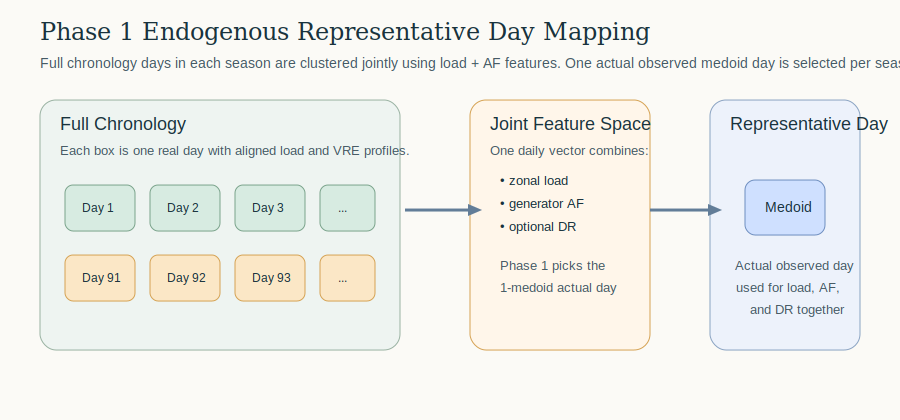

```@meta
CurrentModule = HOPE
```

# Representative Days

HOPE keeps the representative-day mode switch in `HOPE_model_settings.yml`:

```yaml
endogenous_rep_day: 1
external_rep_day: 0
```

When `endogenous_rep_day = 1`, HOPE now reads advanced endogenous representative-day controls from:

```text
Settings/HOPE_rep_day_settings.yml
```

This keeps `HOPE_model_settings.yml` high-level while leaving the chronology-reduction details in a separate advanced settings file.

## Phase 1 Method

Phase 1 improves the old endogenous representative-day process in two ways:

- HOPE builds one joint daily feature vector using aligned load, generator availability, and optional DR profiles.
- HOPE selects one actual observed representative day per time period using a 1-medoid rule, instead of building a synthetic day column by column.

This means load and VRE are now taken from the same real day, which preserves cross-series consistency better than the legacy centroid construction.



## Recommended `HOPE_rep_day_settings.yml`

```yaml
time_periods:
  1: [1, 1, 3, 31]
  2: [4, 1, 6, 30]
  3: [7, 1, 9, 30]
  4: [10, 1, 12, 31]

clustering_method: kmedoids
feature_mode: joint_daily
include_load: 1
include_af: 1
include_dr: 1
normalize_features: 1
```

Meaning:

- `time_periods`: seasonal windows used for endogenous representative-day construction
- `clustering_method: kmedoids`: Phase 1 selects one actual medoid day per time period
- `feature_mode: joint_daily`: cluster one combined daily feature vector, not each column independently
- `include_load`, `include_af`, `include_dr`: control which data streams enter the feature vector
- `normalize_features: 1`: standardize feature dimensions before distance calculations

## Legacy Compatibility

For older cases, HOPE still falls back to `time_periods` from `HOPE_model_settings.yml` if `HOPE_rep_day_settings.yml` is missing.

Phase 1 also keeps a legacy comparison mode:

```yaml
feature_mode: legacy_column_centroid
```

That reproduces the old behavior of building one synthetic centroid day per time period, independently by column.
