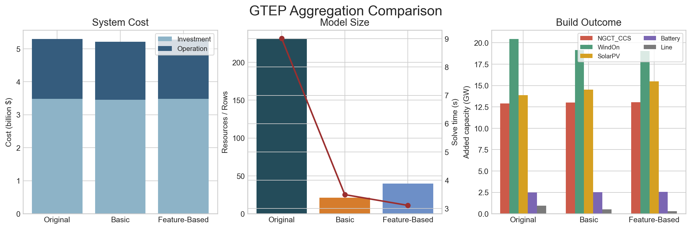
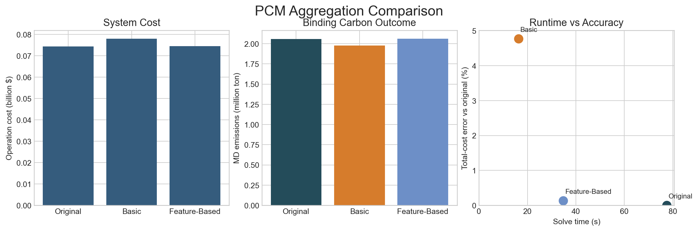

# Resource Aggregation

Resource aggregation is a **fleet simplification** option in HOPE. It is used when a case contains many generators or storage resources that are similar enough to be grouped, and solving the fully disaggregated model would be unnecessarily slow or memory-intensive. In high-level terms, resource aggregation reduces model size by combining similar resources into a smaller set of representative rows, while trying to preserve the characteristics that matter for planning and operations.

This functionality is most useful when users want to accelerate large `GTEP` or `PCM` cases, compare alternative aggregation strategies, or study how much model fidelity is lost when detailed fleets are simplified. It is especially relevant when the original fleet contains many same-zone, same-technology resources, but some of those resources still differ in costs, flexibility, outages, emissions, or commitment behavior. The aggregation methods below are designed to let users control how aggressively HOPE simplifies those fleets and which features should be preserved.

HOPE keeps the high-level aggregation switch in `HOPE_model_settings.yml`:

```yaml
resource_aggregation: 1
```

When `resource_aggregation = 1`, HOPE reads the advanced controls from:

```text
Settings/HOPE_aggregation_settings.yml
```

This keeps `HOPE_model_settings.yml` short while moving the method details into a separate advanced settings file.

## Aggregation Design

HOPE now treats resource aggregation as **two aggregation methods**:

- `basic`
- `feature_based`

For PCM with unit commitment, there is one additional **internal UC treatment**:

- `clustered_thermal_commitment: 0/1`

That PCM switch is not a separate aggregation method. It only changes how aggregated thermal UC resources behave after the grouping step.

## Common Settings

A typical `HOPE_aggregation_settings.yml` starts from:

```yaml
write_aggregation_audit: 1        # 1 write aggregation audit CSVs into output/; 0 disable

# basic = keyed aggregation only
# feature_based = keyed aggregation, then split large groups using clustering features
aggregation_method: basic

# Existing resources are only grouped when all listed fields match.
grouping_keys:
  - Zone
  - Type
  - Flag_RET
  - Flag_mustrun
  - Flag_VRE
  - Flag_thermal

# Additional grouping keys used only in PCM.
pcm_additional_grouping_keys:
  - Flag_UC

# PCM internal UC treatment for aggregated thermal resources.
# 1 = aggregated thermal UC rows track unit counts
# 0 = aggregated thermal UC rows behave like single averaged units
clustered_thermal_commitment: 1

# Numeric columns used only when aggregation_method: feature_based
clustering_feature_columns:
  - Cost (\$/MWh)
  - FOR
  - CC
  - AF
  - RU
  - RD
  - Pmax (MW)
  - Pmin (MW)

# Approximate number of original resources per feature-based cluster.
clustering_target_cluster_size: 4

# Maximum number of feature-based clusters created inside one keyed group.
# 0 = no cap
clustering_max_clusters_per_group: 4

# 1 = z-score normalize clustering features before clustering
# 0 = use raw feature values
normalize_clustering_features: 1

# If empty, all technologies are eligible for aggregation.
aggregate_technologies: []

# Technologies kept fully separate even when resource_aggregation: 1
keep_separate_technologies: []
```

## Audit Outputs

When `write_aggregation_audit: 1`, HOPE writes:

- `resource_aggregation_mapping.csv`
- `resource_aggregation_summary.csv`
- `resource_aggregation_af_summary.csv` in GTEP when generator AF aggregation is available

These outputs let users check:

1. which original resources were merged into each aggregated resource
2. how large each aggregated group is
3. how the aggregated parameters changed after merging

## Method 1: Basic Aggregation

### Focus

`basic` aggregation is the default structured aggregation method.

### Mechanism

HOPE forms groups using:

- `grouping_keys`
- `pcm_additional_grouping_keys` in PCM
- `aggregate_technologies`
- `keep_separate_technologies`

Then HOPE merges each keyed group using technology-family-aware averaging rules already implemented in the input readers.

### Interpretation

`basic` aggregation is:

- transparent
- fast
- easy to audit

But it can blur important within-group heterogeneity if many different resources share the same keyed group.

### Recommendation

Use `basic` aggregation when:

- the fleet is already fairly template-driven
- you mainly want a smaller model
- you want the most stable and fastest aggregated run

## Method 2: Feature-Based Aggregation

### Focus

`feature_based` aggregation is designed for cases where keyed groups are still too heterogeneous.

### Mechanism

HOPE first forms the same keyed groups used by `basic` aggregation. Then, inside each sufficiently large keyed group, it:

1. builds a numeric feature matrix from `clustering_feature_columns`
2. optionally normalizes those features
3. splits the keyed group into smaller sub-clusters
4. aggregates each sub-cluster separately

So the final aggregated fleet stays smaller than the original model, but it keeps more operational and planning structure than `basic`.

### Interpretation

`feature_based` aggregation is best thought of as:

- still an aggregation method
- but a **similarity-aware** one instead of a pure keyed merge

Its quality depends on the feature list. If an important hidden driver is omitted from `clustering_feature_columns`, the result can still differ from the original model.

### Recommendation

Use `feature_based` aggregation when:

- keyed groups contain clear internal heterogeneity
- you want a better accuracy/runtime tradeoff than `basic`
- you know which numeric features are most important for the study

## PCM Internal Option: Clustered Thermal Commitment

`clustered_thermal_commitment` only matters in PCM when:

- `resource_aggregation = 1`
- `unit_commitment != 0`
- aggregated thermal UC rows exist

When it is on, aggregated thermal UC resources keep:

- `NumUnits`
- `ClusteredUnitPmax (MW)`
- `ClusteredUnitPmin (MW)`

and the PCM UC variables count online/startup/shutdown units instead of using a single on/off unit for the aggregated row.

This can improve fidelity for thermal UC behavior, but it does **not** change how resources are grouped. The grouping method is still chosen by `aggregation_method`.

## Comparison Example: GTEP

Saved comparison cases:

- `ModelCases/MD_GTEP_clean_case_methods_original`
- `ModelCases/MD_GTEP_clean_case_methods_basic`
- `ModelCases/MD_GTEP_clean_case_methods_feature`

Settings used in this example:

- `original`
  - `resource_aggregation: 0`
- `basic`

```yaml
aggregation_method: basic
grouping_keys:
  - Zone
  - Type
  - Flag_RET
  - Flag_mustrun
  - Flag_VRE
  - Flag_thermal
clustering_feature_columns:
  - Cost (\$/MWh)
  - FOR
  - Pmax (MW)
  - Pmin (MW)
clustering_target_cluster_size: 4
clustering_max_clusters_per_group: 6
```

- `feature`

```yaml
aggregation_method: feature_based
grouping_keys:
  - Zone
  - Type
  - Flag_RET
  - Flag_mustrun
  - Flag_VRE
  - Flag_thermal
clustering_feature_columns:
  - Cost (\$/MWh)
  - FOR
  - Pmax (MW)
  - Pmin (MW)
clustering_target_cluster_size: 4
clustering_max_clusters_per_group: 6
```

These cases were built to create:

- within-group cost and outage heterogeneity that `feature_based` can partially preserve
- hidden capacity-credit heterogeneity that is **not** in the feature list

So all three methods differ:

| Case | Aggregation | Aggregated Resources | Total Cost (\$) | Solve Time (s) |
| :-- | :-- | --: | --: | --: |
| `original` | none | `231` | `5.299e9` | `9.01` |
| `basic` | keyed merge | `21` | `5.212e9` | `3.49` |
| `feature` | keyed + feature-based split | `40` | `5.273e9` | `3.11` |



Useful files:

- `ModelCases/MD_GTEP_clean_case_methods_original/output/system_cost.csv`
- `ModelCases/MD_GTEP_clean_case_methods_basic/output/system_cost.csv`
- `ModelCases/MD_GTEP_clean_case_methods_feature/output/system_cost.csv`
- `ModelCases/MD_GTEP_clean_case_methods_basic/output/resource_aggregation_summary.csv`
- `ModelCases/MD_GTEP_clean_case_methods_feature/output/resource_aggregation_summary.csv`

Interpretation:

- `basic` is the most compressed and gives the lowest cost in this benchmark
- `feature` keeps more structure than `basic`, so it lands between `basic` and `original`
- both aggregated methods remain much smaller than the original case

## Comparison Example: PCM

Saved comparison cases:

- `ModelCases/MD_PCM_Excel_case_aggmethods_1month_original`
- `ModelCases/MD_PCM_Excel_case_aggmethods_1month_basic`
- `ModelCases/MD_PCM_Excel_case_aggmethods_1month_feature`

Settings used in this example:

- `original`
  - `resource_aggregation: 0`
- `basic`

```yaml
aggregation_method: basic
grouping_keys:
  - Zone
  - Type
  - Flag_mustrun
  - Flag_VRE
  - Flag_thermal
pcm_additional_grouping_keys:
  - Flag_UC
clustered_thermal_commitment: 1
clustering_feature_columns:
  - Cost (\$/MWh)
  - FOR
  - RU
  - RD
  - RM_SPIN
  - Start_up_cost (\$/MW)
  - Min_down_time
  - Min_up_time
  - Pmax (MW)
  - Pmin (MW)
clustering_target_cluster_size: 2
clustering_max_clusters_per_group: 6
```

- `feature`

```yaml
aggregation_method: feature_based
grouping_keys:
  - Zone
  - Type
  - Flag_mustrun
  - Flag_VRE
  - Flag_thermal
pcm_additional_grouping_keys:
  - Flag_UC
clustered_thermal_commitment: 1
clustering_feature_columns:
  - Cost (\$/MWh)
  - EF
  - FOR
  - RU
  - RD
  - RM_SPIN
  - Start_up_cost (\$/MW)
  - Min_down_time
  - Min_up_time
  - Pmax (MW)
  - Pmin (MW)
clustering_target_cluster_size: 2
clustering_max_clusters_per_group: 6
```

This one-month benchmark was built to combine:

- operational heterogeneity that `feature_based` can see
- emissions heterogeneity that becomes important under a binding carbon cap
- a binding carbon cap
- network and reserve constraints
- enough capacity that load shedding is effectively eliminated, so the comparison is driven by operating economics rather than scarcity penalties

So all three methods differ:

| Case | Aggregation | Aggregated Resources | Total Cost (\$) | Solve Time (s) |
| :-- | :-- | --: | --: | --: |
| `original` | none | `285` | `7.4425e7` | `77.49` |
| `basic` | keyed merge | `33` | `7.7976e7` | `16.29` |
| `feature` | keyed + feature-based split | `92` | `7.4525e7` | `34.70` |



Useful files:

- `ModelCases/MD_PCM_Excel_case_aggmethods_1month_original/output/system_cost.csv`
- `ModelCases/MD_PCM_Excel_case_aggmethods_1month_basic/output/system_cost.csv`
- `ModelCases/MD_PCM_Excel_case_aggmethods_1month_feature/output/system_cost.csv`
- `ModelCases/MD_PCM_Excel_case_aggmethods_1month_basic/output/resource_aggregation_summary.csv`
- `ModelCases/MD_PCM_Excel_case_aggmethods_1month_feature/output/resource_aggregation_summary.csv`

Interpretation:

- `basic` and `feature_based` are both much faster than the original PCM case
- `basic` is the fastest PCM option here, but it is also the farthest from the original result
- after adding `EF` to `clustering_feature_columns`, `feature_based` becomes clearly closer to the original than `basic`
- `feature_based` is still not exact, which is useful: it shows that aggregation quality improves when the feature set includes the true binding drivers, but it still depends on how much structure is compressed

For this revised PCM example:

- all three cases have `0` load shedding
- original MD emissions are about `2.059e6` ton
- `basic` shifts that to about `1.978e6` ton
- `feature_based` lands at about `2.062e6` ton

So the comparison now shows the intended message more clearly:

- `basic` is the strongest size reduction and the fastest solve
- `feature_based` is a better fidelity/runtime compromise when the feature set is chosen well
- because scarcity is removed, the differences now reflect dispatch and carbon-constraint behavior rather than emergency unmet load

## Default Aggregation Setting

For most users, the recommended default is:

```yaml
resource_aggregation: 1
```

in `HOPE_model_settings.yml`, together with:

```yaml
write_aggregation_audit: 1
aggregation_method: basic
grouping_keys:
  - Zone
  - Type
  - Flag_RET
  - Flag_mustrun
  - Flag_VRE
  - Flag_thermal
pcm_additional_grouping_keys:
  - Flag_UC
clustered_thermal_commitment: 1
clustering_feature_columns:
  - Cost (\$/MWh)
  - FOR
  - CC
  - AF
  - RU
  - RD
  - Pmax (MW)
  - Pmin (MW)
clustering_target_cluster_size: 4
clustering_max_clusters_per_group: 4
normalize_clustering_features: 1
aggregate_technologies: []
keep_separate_technologies: []
```

Interpretation:

- start from `aggregation_method: basic`
- stay with `basic` when the keyed groups already look fairly homogeneous in the parameters that matter for the study
- use the keyed grouping first
- keep audit outputs on
- in PCM, keep `clustered_thermal_commitment: 1` as the default internal UC treatment for aggregated thermal rows
- add `EF` to `clustering_feature_columns` when emissions are likely to be a binding driver
- only switch to `feature_based` after checking whether the keyed groups are still too heterogeneous for the study objective

## Practical Workflow

1. Start with `resource_aggregation: 1` and `aggregation_method: basic`.
2. Check the audit outputs to see which keyed groups are large or heterogeneous.
3. If needed, switch to `aggregation_method: feature_based`.
4. Tune `clustering_feature_columns` so they reflect the study objective.
5. In PCM with UC, decide separately whether `clustered_thermal_commitment` should stay on.

## References

The current HOPE resource aggregation design was informed by the following literature and software documentation.

1. PyPSA documentation, "Network Clustering." [https://docs.pypsa.org/v1.1.1/user-guide/clustering/](https://docs.pypsa.org/v1.1.1/user-guide/clustering/)

2. GenX.jl documentation, "Model Configuration." [https://genxproject.github.io/GenX.jl/stable/User_Guide/model_configuration/](https://genxproject.github.io/GenX.jl/stable/User_Guide/model_configuration/)

3. GenX.jl documentation, "Workflow." [https://genxproject.github.io/GenX.jl/stable/User_Guide/workflow/](https://genxproject.github.io/GenX.jl/stable/User_Guide/workflow/)

4. Bernardo A. Knueven, James Ostrowski, and Jean-Paul Watson, "On mixed-integer programming formulations for the unit commitment problem," *INFORMS Journal on Computing*, 2020. [https://www.osti.gov/pages/biblio/1421648](https://www.osti.gov/pages/biblio/1421648)

5. Michael Koller and Johannes Hofmann, "Efficient clustering of identical generating units for the MILP unit commitment problem," *Computers & Chemical Engineering*, 2019. DOI: [10.1016/j.compchemeng.2019.03.032](https://doi.org/10.1016/j.compchemeng.2019.03.032)

6. Germán Morales-España and Sergio Tejada-Arango, "Modeling the hidden flexibility of clustered unit commitment," IIT Comillas technical note. [https://www.iit.comillas.edu/publicacion/revista/en/1399/Modeling_the_hidden_flexibility_of_clustered_unit_commitment](https://www.iit.comillas.edu/publicacion/revista/en/1399/Modeling_the_hidden_flexibility_of_clustered_unit_commitment)
